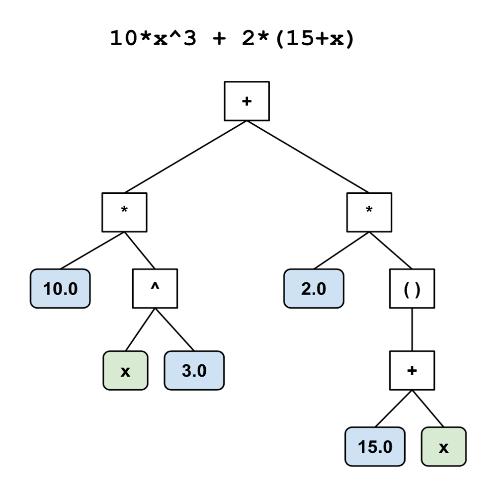

# Graphing Calculator

A graphing calculator built with a recursive descent parser using context-free grammar (CFG). Strings are converted into an expression tree that represents the steps used to evaluate the expression with respect to order of operations.

  
  

